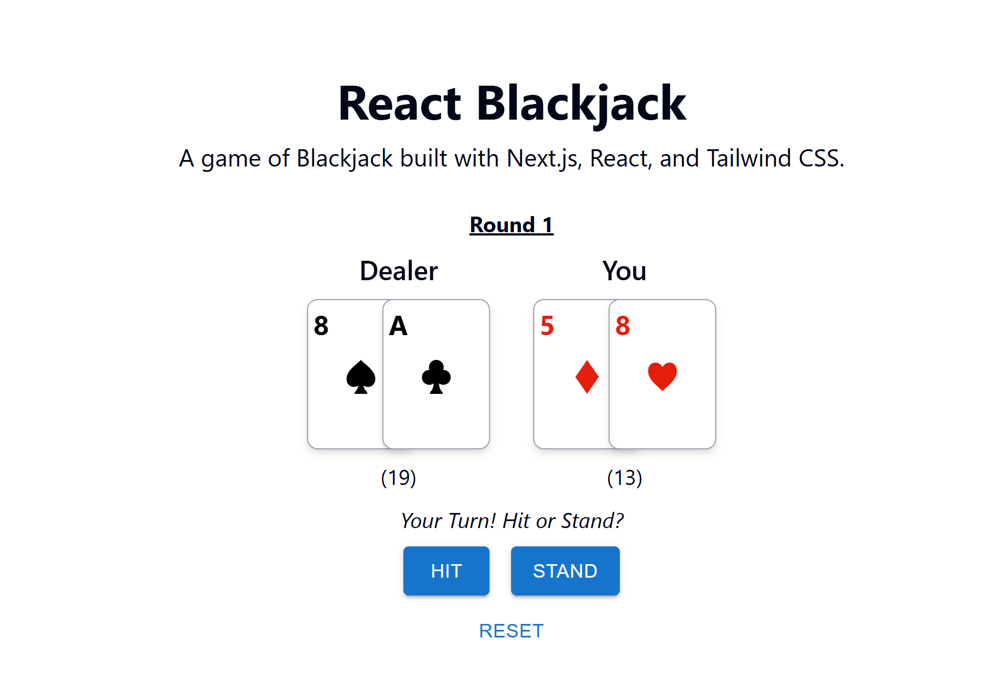

# React Blackjack

A simple Blackjack game built with Next.js, React, TypeScript, and Tailwind CSS. My first attempt at typescript, react, and tailwind!

### Preview:


## Features

- **Classic Blackjack Rules**: Play against an automated dealer.
- **Hit & Stand**: Make decisions to improve your hand or stand with what you have.
- **Automatic Scoring**: The game automatically calculates hand values, including handling Aces as 1 or 11.
- **Win/Loss/Draw Tracking**: See the outcome of each round.
- **Continuous Play**: Start a new round with a single click.
- **Game Reset**: Start over from scratch at any time.

## Tech Stack

- **Framework**: Next.js
- **Language**: TypeScript
- **UI Library**: React
- **Styling**: Tailwind CSS
- **UI Components**: Material UI for buttons.

## How to Play

1.  Click **Start Game** to be dealt your first two cards.
2.  Choose to **Hit** to receive another card or **Stand** to keep your current hand.
3.  The dealer will then play their turn according to standard Blackjack rules (hitting until their score is 17 or higher).
4.  The winner is determined, and you can choose to **Play Again**.

## Getting Started

First, clone the repository and install the dependencies:

```bash
git clone <repository-url>
cd <repository-name>
npm install
```

Navigate to the next_2025 folder.

Then, run the development server:

```bash
npm run dev
```

Open [http://localhost:3000](http://localhost:3000) with your browser to see the result.

You can start editing the page by modifying `app/page.tsx`. The page auto-updates as you edit the file.

This project uses [`next/font`](https://nextjs.org/docs/app/building-your-application/optimizing/fonts) to automatically optimize and load [Geist](https://vercel.com/font), a new font family for Vercel.

## Learn More

To learn more about Next.js, take a look at the following resources:

- [Next.js Documentation](https://nextjs.org/docs) - learn about Next.js features and API.
- [Learn Next.js](https://nextjs.org/learn) - an interactive Next.js tutorial.

You can check out [the Next.js GitHub repository](https://github.com/vercel/next.js) - your feedback and contributions are welcome!

## Icon Attribution
Poker icons created by DinosoftLabs - Flaticon
"https://www.flaticon.com/free-icons/poker"
